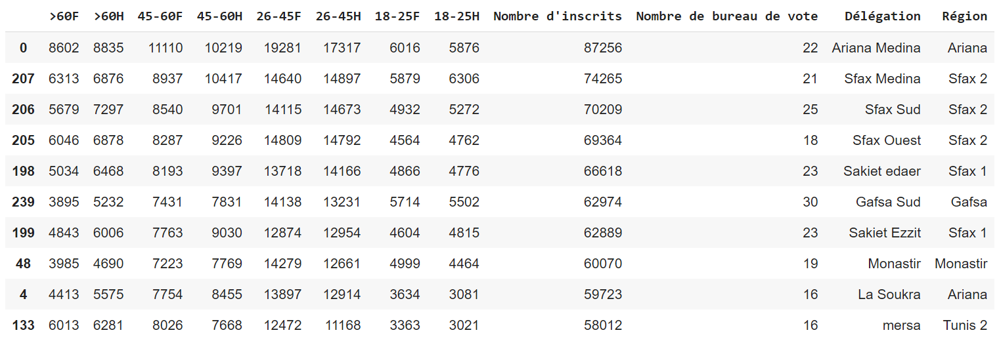

# :open_file_folder: Analyse_Donn-es 

# ** TOP 10 délégations ** :

# **Nombre des inscrits par région** :

 ✅Le nombre d'inscrit le plus elevé est constaté pour la region de Sousse suivi par Ben Arous et ensuite Kairouan et Sfax 2

# **Nombre des délégations par région**

1.   Sousse avec 16 Délégations (5.8%)
2.   Bizerte avec 14 Délégations (5.1%)

# **Nombre de bureau de vote par région**

# **Comparaison entre le nombre de délégation/région et le nombre d'inscrits**

▶
On remarque que les délégations ayant le nombre d'inscrits le plus elevé sont celles ayant un nombre de bureau de vote le plus elevé donc on peut constater que le nombre d'inscrit est proportionnel avec le nombre de bureau de vote

# **Inscrits par tranche d'age** :
|Région|%&gt;60|%\]45-60\]|%\[26-45\]|%\[18-25\]|
|---|---|---|---|---|
|Ariana|18\.0|26\.1|43\.1|12\.8|
|Ben Arous|18\.0|27\.5|41\.7|12\.5|
|Bizerte|20\.0|26\.6|40\.5|12\.7|
|Béja|20\.0|25\.6|40\.9|13\.0|
|Gabès|17\.0|24\.0|44\.0|14\.8|
|Gafsa|16\.0|24\.1|45\.4|14\.8|
|Jendouba|21\.0|24\.0|40\.4|14\.5|
|Kairouan|17\.0|23\.5|44\.6|15\.4|
|Kasserine|15\.0|21\.3|47\.1|16\.5|
|Kebili|17\.0|22\.2|48\.2|12\.9|
|Le Kef|22\.0|26\.6|38\.1|12\.9|
|Mahdia|17\.0|23\.4|44\.9|15\.1|
|Manouba|18\.0|25\.4|42\.8|13\.4|
|Monastir|15\.0|24\.8|45\.0|15\.3|
|Médenine|16\.0|22\.6|46\.5|15\.2|
|Nabeul 1|18\.0|26\.3|42\.5|13\.3|
|Nabeul 2|17\.0|26\.5|43\.6|12\.7|
|Sfax 1|17\.0|24\.8|44\.2|14\.3|
|Sfax 2|17\.0|25\.3|43\.2|14\.4|
|Sidi Bouzid|16\.0|22\.1|47\.4|14\.8|
|Siliana|21\.0|24\.6|41\.3|13\.4|
|Sousse|16\.0|25\.3|45\.1|13\.3|
|Tataouine|16\.0|20\.3|47\.9|16\.1|
|Tozeur|15\.0|24\.3|45\.3|15\.3|
|Tunis 1|20\.0|28\.0|40\.0|12\.1|
|Tunis 2|22\.0|27\.5|40\.0|10\.9|
|Zaghouan|16\.0|23\.2|45\.8|14\.7|

# **Inscrits par genre**

✅
On remarque que le nombre d'inscrit entre homme et femme est presque egale a l'execption de quelques region où on remarque un nombre d'inscrit des hommes plus eleve que celui des femmes

